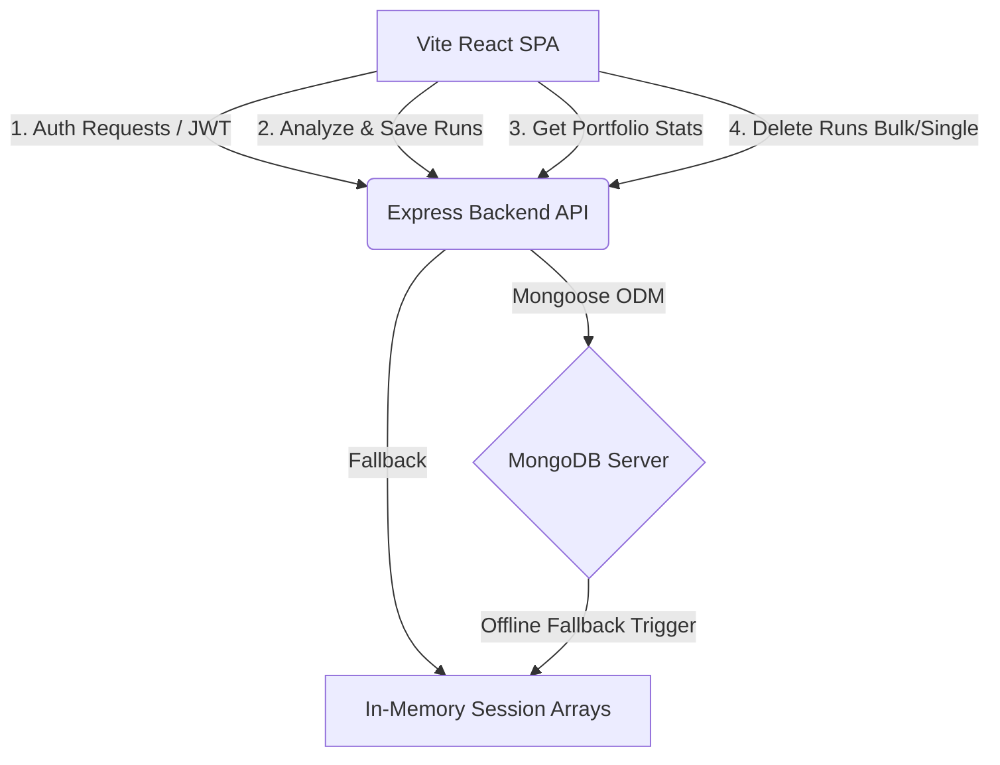

# GoalHorizon | Predictive Financial Planner & Sandbox

GoalHorizon is an engineering-grade **Financial Planning Engine & Feasibility Simulator** built on the full MERN stack (MongoDB, Express, React, Node.js). 

It transitions basic goal calculation into a comprehensive economic sandbox, allowing users to project savings growth under varying market scenarios (Conservative, Moderate, Optimistic), analyze deficit financing options, and track aggregate portfolio health under a unified dashboard.

---

## 🚀 Key Features

*   **Mathematical Financial Projections**: Accurately accounts for yearly goal inflation and monthly compounded return rates using annuity due calculations.
*   **Three Scenario Environments**: Simulates outcomes across:
    *   **Moderate (Base)**: Direct user-selected returns and inflation.
    *   **Conservative**: Lower returns (-2.0%) and higher inflation (+1.5%).
    *   **Optimistic**: Higher returns (+2.0%) and lower inflation (-1.5%).
*   **Interactive Economic Sandbox**: Real-time sliders in the React UI allow users to tweak return and inflation rates, dynamically recalculating the feasibility score and updating projection curves instantly in the browser.
*   **Multi-Curve Trajectory Charts**: Dynamic line charts plotting savings growth pathways under all scenarios against the goal's inflation-adjusted cost curve.
*   **User Profile & Portfolio Analytics**: Clicking the User profile opens an aggregation dashboard summarizing total goals tracked, total capital, average timelines, and outcome distributions.
*   **Deficit Financing (Loan EMI Calculator)**: If a goal is not fully funded, a dynamic EMI calculator helps visualize the monthly repayment and borrowing costs needed to bridge the gap.
*   **Logs & History Storage**: Persistent database storage in MongoDB with automatic **in-memory fallback** if MongoDB is offline (zero server crashes).
*   **JWT Authentication**: Secure user registration and login ensuring goal logs are personalized and protected.

---

## 🛠️ Tech Stack

*   **Frontend**: React (Vite SPA), Chart.js (`react-chartjs-2`), Lucide Icons, Vanilla CSS variables.
*   **Backend**: Node.js, Express, Mongoose (MongoDB ODM), JWT (for sessions), Bcrypt.js (for password hashing), Dotenv.

---

## 📊 System Architecture



---

## 📂 Project Structure

```
├── backend/
│   ├── middleware/      # Auth JWT token verification
│   ├── models/          # Mongoose Schemas (User, GoalAnalysis)
│   ├── routes/          # API Route Handlers (auth, analyze)
│   ├── planningEngine.js# Core interest/annuity formulas
│   ├── validation.js    # Request body parameters sanitizer
│   ├── server.js        # Main Express server config
│   └── .env.example     # Template environment config
├── frontend/
│   ├── public/          # Favicon and logo assets
│   ├── src/
│   │   ├── App.jsx      # Dashboard UI and sandbox controller
│   │   ├── main.jsx     # DOM Mounting point
│   │   └── index.css    # Premium CSS Variables Styling
│   ├── vite.config.js   # Vite server and /api proxy configuration
│   └── package.json     # Frontend dependencies
├── package.json         # Root scripts automation
└── testEngine.js        # Core math test harness
```

---

## 💻 Getting Started

### Prerequisites
*   Node.js (v16.x or higher)
*   NPM (v8.x or higher)
*   MongoDB (optional - falls back to memory if database is offline)

### Setup & Run
1.  **Clone the project** to your local workspace.
2.  **Configure environment variables**: Copy the template `.env.example` to `.env` in the root:
    ```bash
    cp .env.example .env
    ```
3.  **Install dependencies** for both frontend and backend using the root setup command:
    ```bash
    npm run setup
    ```
4.  **Build the React frontend** production assets:
    ```bash
    npm run build
    ```
5.  **Start the MERN application**:
    ```bash
    npm run start
    ```
    Open your browser and navigate to `http://localhost:5200` to interact with the production deployment! (Or run the frontend Vite dev server on port 3000 via `cd frontend && npm run dev`).
